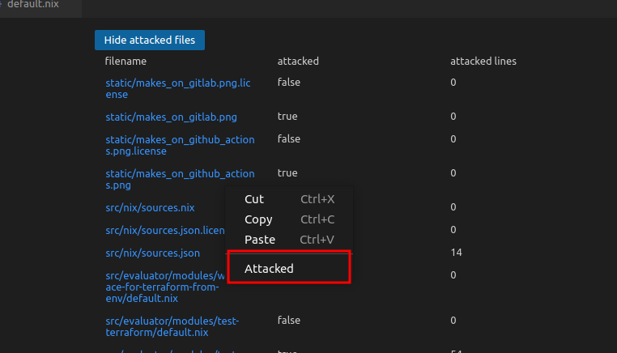

# Fluid Attacks

Fluid Attacks is an extension designed to ease the management of the resources
in our Continuous Hacking service.

It runs automatically on startup and can detect if the current file is
inside the fusion folder in the services repository. If it is in a Services
Fluid Attacks repository it will be activated.

So far, this extension will:

- List Fluid Attacks groups the user has access to
  - List the repositories of each group
    - Clone repositories
    - Get ToE lines
    - Go to file from any ToE lines.
- Obtain the ToE lines of each repository, with information on each file
  - Hide files that have already been attacked
  - Mark a file as attacked. Right-click in the file path
    
- When opening a file, the vulnerabilities reported for the file will be
  consulted and listed as VSCode diagnostics
- Add lines to a vulnerability file

## Installation

This extension requires:

1. The Fluid Attacks API token, either as an environment variable named
   `INTEGRATES_API_TOKEN` or as part of your VSCode settings
   (`.vscode/settings.json`) e.g.

```json
{
  "fluidattacks.apiToken": "your-token-here"
}
```

You also can use the settings menu or the `Set Fluid Attacks Token` command to
set this

1. Open the editor in the base folder of your repository.

> **Note**: Some platform admin roles have access to most or all of the groups,
> but these groups are not directly assigned to the user, which may cause
> the groups to not be appear in the extension's menu. To list additional
> groups they must be added to the vscode settings e.g.
>
> ```json
> {
>   "fluidattacks.extraGroups": ["your-group-here", "another-group"]
> }
> ```

## Support

If you have any questions you can check our
[documentation](https://docs.fluidattacks.com/machine/vscode-extension/) or
feel free to contact us at help@fluidattacks.com.
